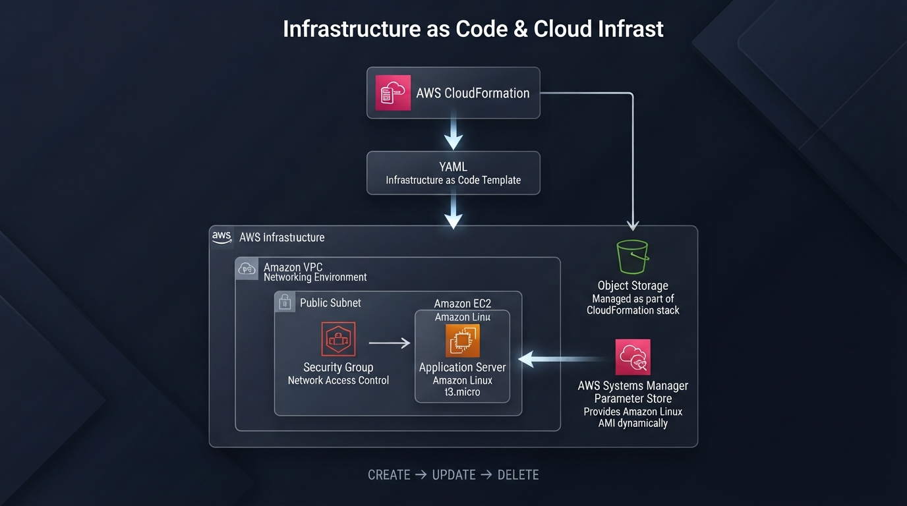

## AWS-CloudFormation-Infrastructure-as-Code-Cloud-Infrastructure-Automation

** Designing, provisioning and managing AWS infrastructure using declarative YAML templates** 

## Cloud Engineering • Infrastructure as Code • Infrastructure Automation • AWS Solutions

  

## Overview

This project demonstrates how AWS CloudFormation can be used to provision and manage cloud infrastructure through **Infrastructure as Code (IaC)**.

The infrastructure was defined using **YAML templates**, allowing AWS resources to be created and updated from a single declarative configuration instead of being provisioned individually through the AWS Management Console.

The environment was built progressively, starting with an **Amazon VPC and Security Group**, followed by the addition of an **Amazon S3 bucket** and an **Amazon EC2 instance**.

During the implementation, the CloudFormation template was updated to add new resources while preserving the existing infrastructure. **CloudFormation intrinsic functions such as `!Ref`** were used to reference resources within the template, and **AWS Systems Manager Parameter Store** was used to retrieve the Amazon Linux AMI dynamically.

The project also covered the complete lifecycle of the CloudFormation stack, from initial deployment and updates to the final removal of the infrastructure.

**CREATE → UPDATE → DELETE**

This project provided practical experience with **AWS infrastructure automation, Infrastructure as Code, resource dependencies, cloud networking, compute, storage, and infrastructure lifecycle management**.

## CloudFormation Lab Experience

This laboratory was one of the most meaningful moments of my AWS learning journey.

After spending many hours studying CloudFormation and understanding its concepts, seeing the service actually provision and manage AWS resources in real time was a remarkable experience.

I was no longer just studying Infrastructure as Code. I was defining infrastructure through a YAML template, deploying it through CloudFormation, observing the resources being created, and understanding how the components worked together.

There is something genuinely powerful about seeing infrastructure come to life from code. It made me realize how powerful Infrastructure as Code can be: **an intelligent, practical, and structured way to transform infrastructure into code and manage it with greater consistency and control.**

It was the moment when CloudFormation stopped being just a concept I had studied and became something I could actually use to build and manage cloud infrastructure.

This experience reinforced something I have been building throughout my cloud journey:

**study → practice → understand → build**

And that is what makes this laboratory especially meaningful to me: transforming knowledge into a working Cloud solution.

**study → practice → understand → build**

And that is what makes this laboratory especially meaningful to me: transforming knowledge into a working Cloud solution.

  

## Architecture

This hands-on laboratory demonstrates how AWS CloudFormation can be used to provision and manage AWS cloud infrastructure through a declarative YAML template.

The infrastructure was built progressively, integrating networking, security, compute, storage, and configuration management into a single CloudFormation stack.

  

### Architecture Components

| Component | Purpose |
|---|---|
| **AWS CloudFormation** | Orchestrates the infrastructure through Infrastructure as Code |
| **Amazon VPC** | Provides the network environment for the infrastructure |
| **Security Group** | Controls network access to the EC2 instance |
| **Public Subnet** | Provides the network segment where the EC2 instance is deployed |
| **Amazon EC2** | Provides the compute layer for the application server |
| **Amazon S3** | Provides object storage managed as part of the CloudFormation stack |
| **AWS Systems Manager Parameter Store** | Dynamically provides the Amazon Linux AMI |
| **YAML Template** | Defines the desired infrastructure configuration |

