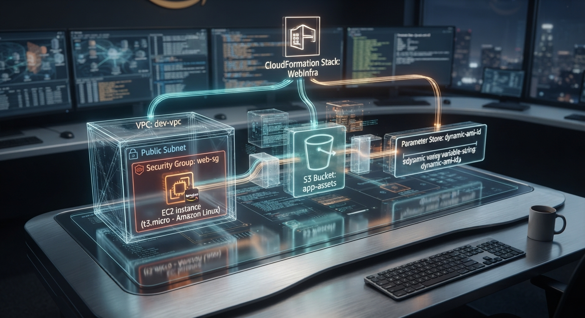
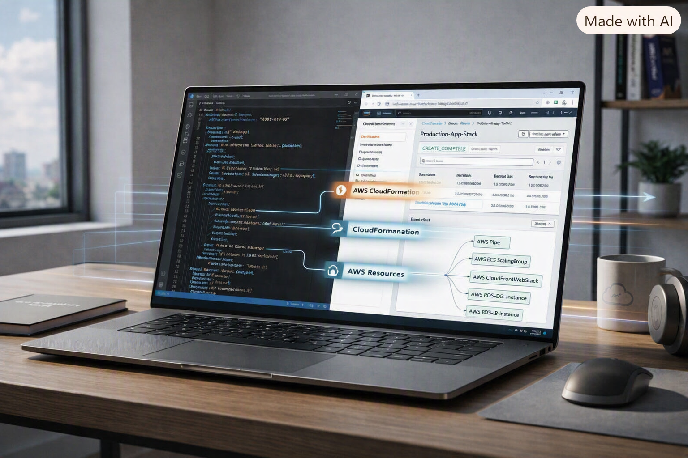

### AWS CloudFormation — Infrastructure as Code
**Escrevi uma infraestrutura inteira em YAML, cliquei em "Create Stack", e vi o AWS fazer o trabalho sujo por mim.
Depois eu atualizei o mesmo template pra adicionar um S3 sem derrubar nada. E no final, deletei tudo com um clique. Medo e alívio ao mesmo tempo.**

https://aws.amazon.com/
https://aws.amazon.com/cloudformation/
https://yaml.org/
https://aws.amazon.com/ec2/
https://aws.amazon.com/vpc/
https://aws.amazon.com/s3/

  

## O que é isso

Lab prático de AWS CloudFormation feito durante o AWS re/Start. O objetivo era simples: em vez de clicar no console AWS pra criar VPC, Subnet, Security Group, EC2 e S3, eu escrevi tudo num arquivo YAML e deixei o CloudFormation criar sozinho.
Ciclo completo: CREATE → UPDATE → DELETE

## A arquitetura

  

## O template YAML

O coração do lab é esse arquivo. Nele eu defini:

* VPC com CIDR block
* Public Subnet dentro da VPC
* Security Group permitindo SSH (22) e HTTP (80) do meu IP
* EC2 t3.micro com Amazon Linux, usando AMI do Parameter Store
* S3 Bucket com versionamento

## Trecho do template

AWSTemplateFormatVersion: '2010-09-09'
Description: 'Infraestrutura basica com VPC, EC2 e S3'

Parameters:
  AMIId:
    Type: AWS::SSM::Parameter::Value<AWS::EC2::Image::Id>
    Default: /aws/service/ami-amazon-linux-latest/amzn2-ami-hvm-x86_64-gp2

Resources:
  MinhaVPC:
    Type: AWS::EC2::VPC
    Properties:
      CidrBlock: 10.0.0.0/16
      EnableDnsHostnames: true
      Tags:
        - Key: Name
          Value: !Ref AWS::StackName

  MinhaSubnet:
    Type: AWS::EC2::Subnet
    Properties:
      VpcId: !Ref MinhaVPC
      CidrBlock: 10.0.1.0/24
      MapPublicIpOnLaunch: true

  MeuSecurityGroup:
    Type: AWS::EC2::SecurityGroup
    Properties:
      GroupDescription: SG para acesso SSH e HTTP
      VpcId: !Ref MinhaVPC
      SecurityGroupIngress:
        - IpProtocol: tcp
          FromPort: 22
          ToPort: 22
          CidrIp: MEU_IP/32
        - IpProtocol: tcp
          FromPort: 80
          ToPort: 80
          CidrIp: 0.0.0.0/0

  MinhaInstancia:
    Type: AWS::EC2::Instance
    Properties:
      ImageId: !Ref AMIId
      InstanceType: t3.micro
      SubnetId: !Ref MinhaSubnet
      SecurityGroupIds:
        - !Ref MeuSecurityGroup
      Tags:
        - Key: Name
          Value: !Sub '${AWS::StackName}-EC2'

  MeuBucket:
    Type: AWS::S3::Bucket
    Properties:
      BucketName: !Sub '${AWS::StackName}-bucket-${AWS::AccountId}'
      VersioningConfiguration:
        Status: Enabled

## Etapa 1: CREATE — Criar do zero

Fui no console AWS → CloudFormation → Create Stack → Upload do YAML.

Cliquei em "Submit" e fiquei olhando a tela de eventos: 

CREATE_IN_PROGRESS  MinhaVPC
CREATE_COMPLETE     MinhaVPC
CREATE_IN_PROGRESS  MinhaSubnet
CREATE_COMPLETE     MinhaSubnet
CREATE_IN_PROGRESS  MeuSecurityGroup
CREATE_COMPLETE     MeuSecurityGroup
CREATE_IN_PROGRESS  MinhaInstancia
CREATE_COMPLETE     MinhaInstancia
CREATE_COMPLETE     Stack

Cerca de 3 minutos. Sem eu clicar em nada. A VPC, a subnet, o SG, a EC2 — tudo surgindo sozinho a partir do meu YAML.
O momento "GENIAL": Eu não criei a instância. Eu descrevi a instância. O CloudFormation criou. Isso é Infrastructure as Code.

## Etapa 2: UPDATE — Adicionar sem destruir

Depois que funcionou, quis adicionar um S3 Bucket no mesmo stack.
Editei o YAML, adicionei o recurso MeuBucket, e fiz Update Stack com o novo template.

O CloudFormation:

* Manteve tudo que já existia (VPC, Subnet, SG, EC2)
* Criou só o que era novo (S3)
* Não tocou no que não mudou
  
Isso me mostrou o poder do estado gerenciado. O CloudFormation sabe o que já existe e só aplica deltas. Não precisa recriar a roda toda vez.

## Overview

This project demonstrates how AWS CloudFormation can be used to provision and manage cloud infrastructure through **Infrastructure as Code (IaC)**.

The infrastructure was defined using **YAML templates**, allowing AWS resources to be created and updated from a single declarative configuration instead of being provisioned individually through the AWS Management Console.

The environment was built progressively, starting with an **Amazon VPC and Security Group**, followed by the addition of an **Amazon S3 bucket** and an **Amazon EC2 instance**.

During the implementation, the CloudFormation template was updated to add new resources while preserving the existing infrastructure. **CloudFormation intrinsic functions such as `!Ref`** were used to reference resources within the template, and **AWS Systems Manager Parameter Store** was used to retrieve the Amazon Linux AMI dynamically.

The project also covered the complete lifecycle of the CloudFormation stack, from initial deployment and updates to the final removal of the infrastructure.

**CREATE → UPDATE → DELETE**

This project provided practical experience with **AWS infrastructure automation, Infrastructure as Code, resource dependencies, cloud networking, compute, storage, and infrastructure lifecycle management**.

  

## CloudFormation Lab Experience

This laboratory was one of the most meaningful moments of my AWS learning journey.

After spending many hours studying CloudFormation and understanding its concepts, seeing the service actually provision and manage AWS resources in real time was a remarkable experience.

I was no longer just studying Infrastructure as Code. I was defining infrastructure through a YAML template, deploying it through CloudFormation, observing the resources being created, and understanding how the components worked together.

There is something genuinely powerful about seeing infrastructure come to life from code. It made me realize how powerful Infrastructure as Code can be: **an intelligent, practical, and structured way to transform infrastructure into code and manage it with greater consistency and control.**

It was the moment when CloudFormation stopped being just a concept I had studied and became something I could actually use to build and manage cloud infrastructure.

This experience reinforced something I have been building throughout my cloud journey:

**study → practice → understand → build**

And that is what makes this laboratory especially meaningful to me: transforming knowledge into a working Cloud solution.

  

## Architecture

The architecture below represents the infrastructure I built using **AWS CloudFormation**.

Instead of creating each resource manually through the AWS Console, I defined the infrastructure in a YAML template and allowed CloudFormation to provision the resources and their relationships.

At the network and compute layer, the stack creates a **VPC** and **Subnet**, together with a **Security Group** that controls access to the **EC2 instance**.

The same CloudFormation template also provisions an **Amazon S3 bucket**, keeping storage as a separate component of the infrastructure.

For the EC2 provisioning process, **AWS Systems Manager Parameter Store** is used to retrieve the **AMI ID dynamically**, while the selected **AMI** provides the image used to launch the instance.

The architecture brings the main elements of the lab together in a single infrastructure definition:

**CloudFormation → VPC → Subnet / Security Group → EC2**

and, in parallel:

**CloudFormation → S3**

with **Parameter Store** providing the AMI information used during EC2 provisioning.

More than simply creating AWS resources, this exercise allowed me to see how infrastructure can be described as code, with the relationships between its components defined before the environment is actually created.

  

### Architecture Components

| Component | Purpose |
|---|---|
| **AWS CloudFormation** | Orchestrates the infrastructure through Infrastructure as Code |
| **Amazon VPC** | Provides the network environment for the infrastructure |
| **Security Group** | Controls network access to the EC2 instance |
| **Public Subnet** | Provides the network segment where the EC2 instance is deployed |
| **Amazon EC2** | Provides the compute layer for the application server |
| **Amazon S3** | Provides object storage managed as part of the CloudFormation stack |
| **AWS Systems Manager Parameter Store** | Dynamically provides the Amazon Linux AMI |
| **YAML Template** | Defines the desired infrastructure configuration |

## Infrastructure as Code

AWS CloudFormation enables infrastructure to be defined and managed as code, replacing manual resource provisioning with a declarative and repeatable approach.

In this laboratory, the infrastructure was described using a **YAML template**, defining the AWS resources and their relationships within a CloudFormation stack.

The template was progressively updated during the implementation, allowing new resources to be added while CloudFormation managed the changes to the existing infrastructure.
### CloudFormation Template

