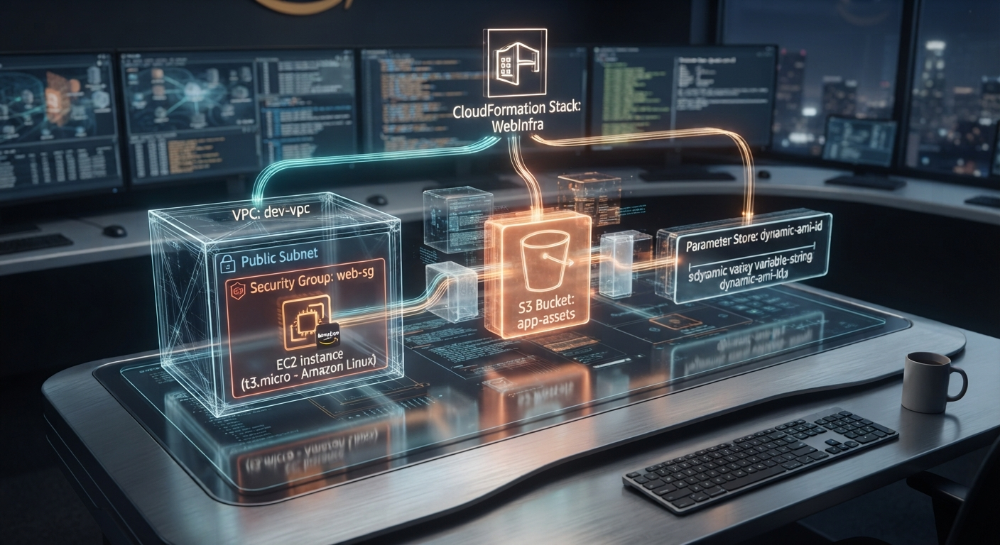

### AWS CloudFormation — Infrastructure as Code
**Escrevi uma infraestrutura inteira em YAML, cliquei em "Create Stack", e vi o AWS fazer o trabalho sujo por mim.
Depois eu atualizei o mesmo template pra adicionar um S3 sem derrubar nada. E no final, deletei tudo com um clique. Medo e alívio ao mesmo tempo.**

https://aws.amazon.com/
https://aws.amazon.com/cloudformation/
https://yaml.org/
https://aws.amazon.com/ec2/
https://aws.amazon.com/vpc/
https://aws.amazon.com/s3/

  

## O que é isso

Lab prático de AWS CloudFormation feito durante o AWS re/Start. O objetivo era simples: em vez de clicar no console AWS pra criar VPC, Subnet, Security Group, EC2 e S3, eu escrevi tudo num arquivo YAML e deixei o CloudFormation criar sozinho.
Ciclo completo: CREATE → UPDATE → DELETE

## A arquitetura

  

## O template YAML

O coração do lab é esse arquivo. Nele eu defini:

* VPC com CIDR block
* Public Subnet dentro da VPC
* Security Group permitindo SSH (22) e HTTP (80) do meu IP
* EC2 t3.micro com Amazon Linux, usando AMI do Parameter Store
* S3 Bucket com versionamento

## Trecho do template
AWSTemplateFormatVersion: '2010-09-09'
Description: 'Infraestrutura basica com VPC, EC2 e S3'

Parameters:
  AMIId:
    Type: AWS::SSM::Parameter::Value<AWS::EC2::Image::Id>
    Default: /aws/service/ami-amazon-linux-latest/amzn2-ami-hvm-x86_64-gp2

Resources:
  MinhaVPC:
    Type: AWS::EC2::VPC
    Properties:
      CidrBlock: 10.0.0.0/16
      EnableDnsHostnames: true
      Tags:
        - Key: Name
          Value: !Ref AWS::StackName

  MinhaSubnet:
    Type: AWS::EC2::Subnet
    Properties:
      VpcId: !Ref MinhaVPC
      CidrBlock: 10.0.1.0/24
      MapPublicIpOnLaunch: true

  MeuSecurityGroup:
    Type: AWS::EC2::SecurityGroup
    Properties:
      GroupDescription: SG para acesso SSH e HTTP
      VpcId: !Ref MinhaVPC
      SecurityGroupIngress:
        - IpProtocol: tcp
          FromPort: 22
          ToPort: 22
          CidrIp: MEU_IP/32
        - IpProtocol: tcp
          FromPort: 80
          ToPort: 80
          CidrIp: 0.0.0.0/0

  MinhaInstancia:
    Type: AWS::EC2::Instance
    Properties:
      ImageId: !Ref AMIId
      InstanceType: t3.micro
      SubnetId: !Ref MinhaSubnet
      SecurityGroupIds:
        - !Ref MeuSecurityGroup
      Tags:
        - Key: Name
          Value: !Sub '${AWS::StackName}-EC2'

  MeuBucket:
    Type: AWS::S3::Bucket
    Properties:
      BucketName: !Sub '${AWS::StackName}-bucket-${AWS::AccountId}'
      VersioningConfiguration:
        Status: Enabled

## Etapa 1: CREATE — Criar do zero

Fui no console AWS → CloudFormation → Create Stack → Upload do YAML.

Cliquei em "Submit" e fiquei olhando a tela de eventos: 

* CREATE_IN_PROGRESS  MinhaVPC
* CREATE_COMPLETE     MinhaVPC
* CREATE_IN_PROGRESS  MinhaSubnet
* CREATE_COMPLETE     MinhaSubnet
* CREATE_IN_PROGRESS  MeuSecurityGroup
* CREATE_COMPLETE     MeuSecurityGroup
* CREATE_IN_PROGRESS  MinhaInstancia
* CREATE_COMPLETE     MinhaInstancia
* CREATE_COMPLETE     Stack

Cerca de 3 minutos. Sem eu clicar em nada. A VPC, a subnet, o SG, a EC2 — tudo surgindo sozinho a partir do meu YAML.
O momento "GENIAL": Eu não criei a instância. Eu descrevi a instância. O CloudFormation criou. Isso é Infrastructure as Code.

## Etapa 2: UPDATE — Adicionar sem destruir

Depois que funcionou, quis adicionar um S3 Bucket no mesmo stack.
Editei o YAML, adicionei o recurso MeuBucket, e fiz Update Stack com o novo template.

O CloudFormation:

* Manteve tudo que já existia (VPC, Subnet, SG, EC2)
* Criou só o que era novo (S3)
* Não tocou no que não mudou
  
Isso me mostrou o poder do estado gerenciado. O CloudFormation sabe o que já existe e só aplica deltas. Não precisa recriar a roda toda vez.

  

## Etapa 3: DELETE — O medo do botão vermelho

Última etapa do lab: deletar o stack.
Fiquei com medo. Sério. Pensei: "E se ele não apagar direito? E se ficar recurso órfão? E se eu me arrepender?"
Cliquei em Delete. Confirmei.

DELETE_IN_PROGRESS  MinhaInstancia
DELETE_COMPLETE     MinhaInstancia
DELETE_IN_PROGRESS  MeuSecurityGroup
DELETE_COMPLETE     MeuSecurityGroup
DELETE_IN_PROGRESS  MinhaSubnet
DELETE_COMPLETE     MinhaSubnet
DELETE_IN_PROGRESS  MinhaVPC
DELETE_COMPLETE     MinhaVPC
DELETE_COMPLETE     Stack

Tudo limpo. Nenhum recurso ficou pra trás. O CloudFormation rastreia dependências e deleta na ordem certa.

## O que eu aprendi: 
Criar é fácil. Deletar de forma limpa é onde o CloudFormation prova que vale a pena.

## O pulo do gato: Parameter Store

Repare nisso aqui no template.

Parameters:
  AMIId:
    Type: AWS::SSM::Parameter::Value<AWS::EC2::Image::Id>
    Default: /aws/service/ami-amazon-linux-latest/amzn2-ami-hvm-x86_64-gp2

Em vez de hardcodar um AMI ID (ami-0abc123...), eu usei o AWS Systems Manager Parameter Store pra buscar a AMI mais recente do Amazon Linux automaticamente.

Por que isso importa: AMI IDs mudam de região pra região e de tempos em tempos. Hardcodar é pedir pra quebrar. Usar Parameter Store = template portável e atualizado.

## Como os recursos se conversam

Usei intrinsic functions do CloudFormation pra criar dependências:

| Função       | Onde usei                | Pra quê                                   |
| ------------ | ------------------------ | ----------------------------------------- |
| `!Ref`       | `VpcId: !Ref MinhaVPC`   | Referenciar um recurso dentro do template |
| `!Sub`       | `BucketName: !Sub '...'` | Substituir variáveis em strings           |
| `!Ref AMIId` | `ImageId: !Ref AMIId`    | Pegar o valor do parâmetro                |

Usei intrinsic functions do CloudFormation pra criar dependências:

Sem essas funções, eu teria que repetir IDs e valores. Com elas, o template fica limpo e conectado.

 ## Tech Stack
* AWS CloudFormation — orquestração da infraestrutura
* YAML — linguagem declarativa do template
* Amazon VPC — rede isolada
* Public Subnet — segmento de rede pública
* Security Group — firewall da instância
* mazon EC2 — compute layer
* Amazon S3 — storage com versionamento
* AWS Systems Manager Parameter Store — AMI dinâmica
* Intrinsic Functions (!Ref, !Sub) — conexão entre recursos

## O que esse lab realmente me ensinou

1.Console é para explorar. Código é para repetir. Eu posso criar uma VPC no console em 2 minutos. Mas se eu precisar criar 10? Ou recriar daqui 6 meses? YAML não esquece.
2.UPDATE é mais importante que CREATE. Qualquer um clica em criar. Saber adicionar recurso novo sem derrubar o que existe é onde o CloudFormation brilha.
3.DELETE limpo é raro no mundo real. Sem CloudFormation, deletar uma VPC manualmente é um pesadelo de dependências. Com ele, é um clique.
4.Parameter Store é vida. Nunca mais vou hardcodar AMI ID. Nunca.

## 🚧 Status

[x] Stack criado do zero (CREATE)
[x] Stack atualizado com novo recurso (UPDATE)
[x] Stack deletado sem deixar lixo (DELETE)
[x] Template YAML documentado
[ ] Refazer isso em Terraform (em breve)

## 🌐 Contato

💼 LinkedIn: linkedin.com/in/eliana-diniz
📧 E-mail: eliana.dinizsilva@gmail.com
"Criei uma VPC, uma subnet, um security group, uma EC2 e um S3. Sem clicar em nenhum deles. Só escrevi. E o AWS leu."

