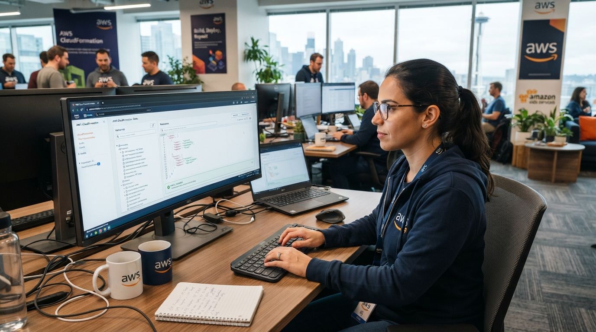

## AWS-CloudFormation-Infrastructure-as-Code-Cloud-Infrastructure-Automation

** Designing, provisioning and managing AWS infrastructure using declarative YAML templates** 

## Cloud Engineering • Infrastructure as Code • Infrastructure Automation • AWS Solutions

  

## Overview

This project demonstrates how AWS CloudFormation can be used to provision and manage cloud infrastructure through **Infrastructure as Code (IaC)**.

The infrastructure was defined using **YAML templates**, allowing AWS resources to be created and updated from a single declarative configuration instead of being provisioned individually through the AWS Management Console.

The environment was built progressively, starting with an **Amazon VPC and Security Group**, followed by the addition of an **Amazon S3 bucket** and an **Amazon EC2 instance**.

During the implementation, the CloudFormation template was updated to add new resources while preserving the existing infrastructure. **CloudFormation intrinsic functions such as `!Ref`** were used to reference resources within the template, and **AWS Systems Manager Parameter Store** was used to retrieve the Amazon Linux AMI dynamically.

The project also covered the complete lifecycle of the CloudFormation stack, from initial deployment and updates to the final removal of the infrastructure.

**CREATE → UPDATE → DELETE**

This project provided practical experience with **AWS infrastructure automation, Infrastructure as Code, resource dependencies, cloud networking, compute, storage, and infrastructure lifecycle management**.
